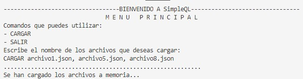
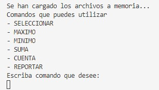
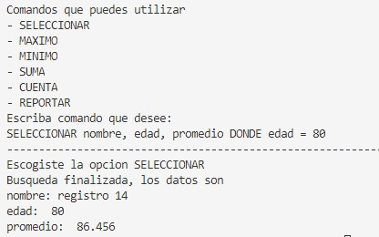
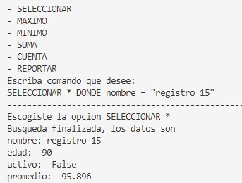
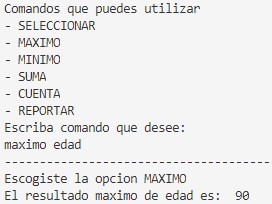
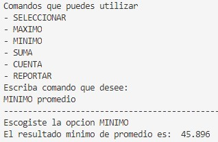
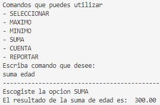
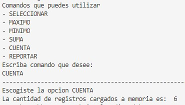
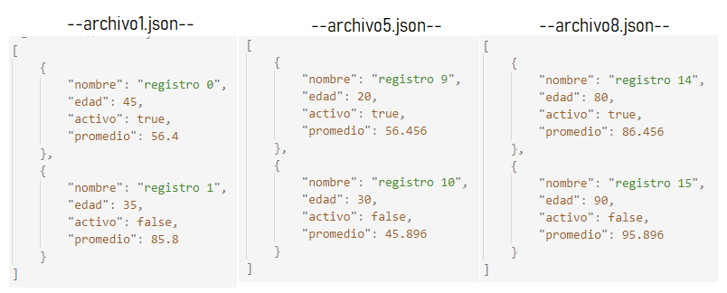

# MANUAL DE USUARIO SimpleQL
## Descripción
SimpleQL es un lenguaje de consultas que funciona únicamente a nivel de consola, su propósito es facilitar al usuario la búsqueda de registros completos en archivos json, en los que buscar registro por registro podría ser muy tedioso y cansado. SimpleQL permite al usuario cargar información a memoria por medio de comandos y obtener algunos datos generales acerca de esta, como el número de registros, el valor máximo de un atributo o incluso un reporte de en html de un conjunto de registros. 

## Caracteristicas de SimpleQL
- Todos los comandos y campos son *case insensitive* esto quiere decir que si el usuario introduce el comando "caRGar" el programa identificara que trata del comando "CARGAR".
- La extensión de archivos que maneja SimpleQL es .json, la estructura de como deben ser los archivos se mostrara al final de este manual. 

## Comandos
### **CARGAR**
Al iniciar el programa Este comando permitirá la carga de diferentes archivos a memoria, el único parámetro que lo conforma es una lista de direcciones a los archivos que cargará a memoria. El usuario no podra realizar el funcionamiento de otro comando sin cargar archivos. 
###### Ejemplo: CARGAR archivo1, archivo2, archivo3, …… archivoN

Al seleccionar este comando el usuario podra utilizar los otros comandos disponibles en el programa, asimismo se le presentara una lista de estos y esperara su lectura. 

### **SELECCIONAR**
Permite seleccionar uno o más registros o atributos que se encuentran en los archivos que cargamos con anterioridad con base en condiciones simples que pueden aplicarse a los atributos de los mismos. Se puede seleccionar uno o cuatro registros utilizando como condicion cualquiera de estos registros tambien, sino esta no se encuentra se mostrara un mensaje de aviso. 
Para utilizar un nombre en una condición este siempre debe venir dentro de comillas.
###### Ejemplo: SELECCIONAR nombre, edad, promedio DONDE edad = 80

#### - SELECCIONAR *
Si el usuario selecciona este comando en lugar de nombrar los atributos uno por uno, entonces automáticamente se seleccionan todos los atributos. Puede solicitarse cualquier
combinación de atributos, siempre y cuando no se repitan y pertenezcan a los atributos listados en el archivo JSON.
###### Ejemplo: SELECCIONAR * DONDE nombre = "registro 15"

### **MAXIMO**
Este comando permite encontrar el valor máximo que se encuentre en los atributos de los registros de los archivos cargados a memoria.
El comando MAXIMO solo se puede seleccionar con los atributos "edad" o "promedio" si el usario ingresa otro atributo se le avisara. 
###### Ejemplo: MAXIMO edad

### **MINIMO**
Este comando permite encontrar el valor minimo que se encuentre en los atributos de los registros de los archivos cargados a memoria.
El comando MINIMO solo se puede seleccionar con los atributos "edad" o "promedio" si el usario ingresa otro atributo se le avisara. 
###### Ejemplo: MINIMO promedio

### **SUMA**
Este comando permite sumar todos los valroes que se encuentren en los atributos de los registros de los archivos cargados a memoria.
El comando SUMA solo se puede seleccionar con los atributos "edad" o "promedio" si el usario ingresa otro atributo se le avisara. 
###### Ejemplo: MAXIMO edad

### **CUENTA**
Permite contar el número de registros que se han cargado a memoria.
###### Ejemplo: CUENTA 

### **REPORTAR**
Este comando permite crear un reporte en html que contiene la cantidad de registros que el usuario ingrese.
###### Ejemplo: REPORTAR 5

## Apendice
Los archivos con sus respectivos registros y atributos utilizados, en los ejemplos para demostrar la funcionalidad de cada comando son los siguientes: 

*Esta misma estructura deben tener los archivos .json a utilizar en el programa*

